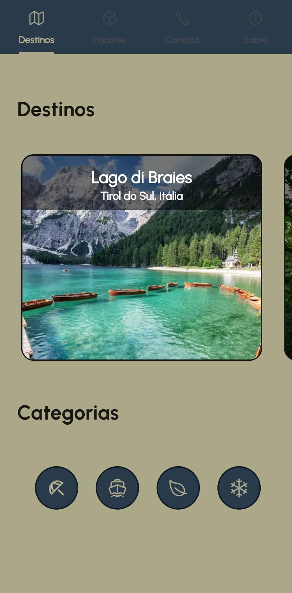
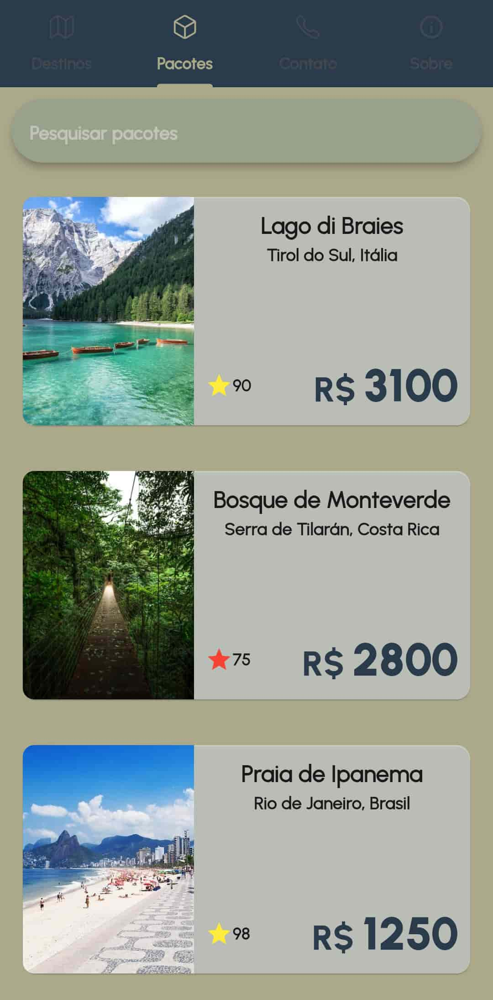
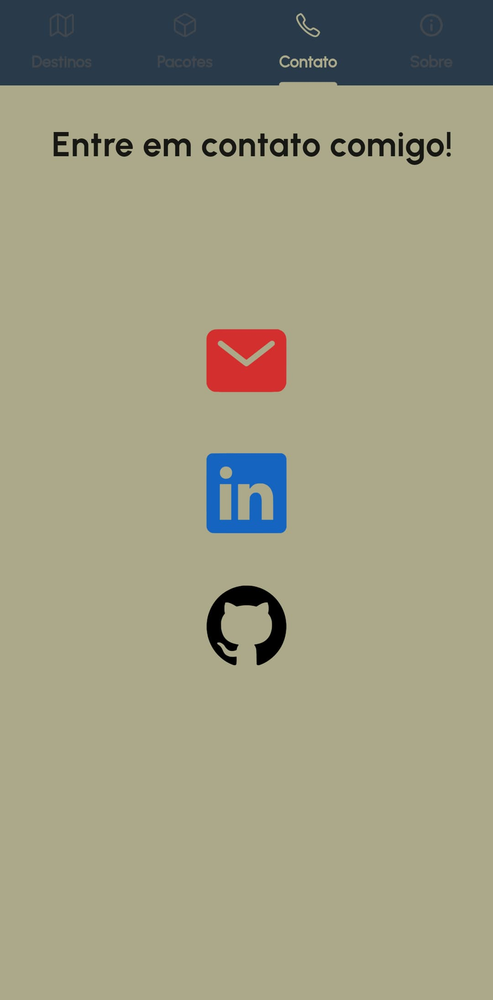
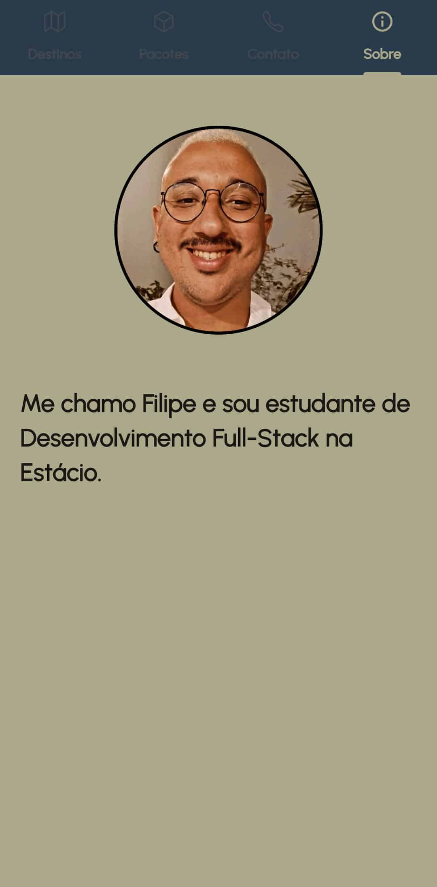

# Explore Mundo App

A "Explore Mundo", uma Agência de Viagens, está em busca de melhorias para tornar
seu aplicativo mais atrativo e funcional para os clientes. O objetivo é proporcionar uma
experiência em que os usuários possam explorar destinos, consultar pacotes de
viagens, efetuar reservas, entrar em contato com a equipe e obter informações
detalhadas sobre a localização e as avaliações de estrelas para cada destino. App criado baseado no que foi pedido na missão prática do nível 2 (RPG0024 - Posso criar um App de outra forma) do Mundo 4 no curso de Desenvolvimento Full-Stack da Estácio.


## Stack utilizada

**Mobile:** Flutter


## Rodando localmente

### Clone o projeto

```bash
  git clone https://github.com/Alvimm/m4n2
```


### Entre no diretório do projeto

```bash
  cd m4n2
```


### Instale as dependências

```bash
  flutter pub get
```


### Inicie a aplicação

```bash
flutter run
```


## Screenshots

<div style="display: flex; justify-content: center;">
  
  
  
  
  
</div> 


## Autor

- [@alvimm](https://www.github.com/Alvimm)